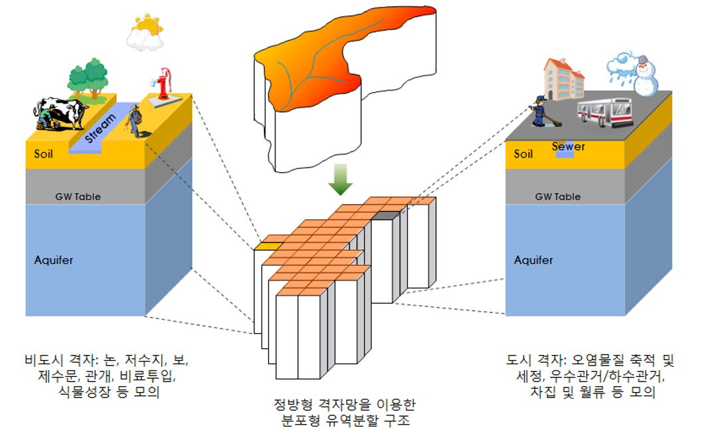

# 2. 주요 특징

- 완전 분포형 유역모델 지향
- 물리식에 기초한 개별 프로세스의 명시적 표현
- 지표수 및 지하수 통합 모의, 소규모 유역 수문/수질 분석 및 평가에 적합

Fig 1. CAMEL 유역분할 구조

 

Table 1. CAMEL 주요모의 기능

|구분|주요모의 기능|
|-|-|
|수문|지표수 및 지하수의 통합 모의   농업용 수리시설 (e.g. 논, 저수지, 보, 제수문)   도시지역 우하수관거 월류수(CSOs 및 SSOs)|
|입자성 물질|4개 입도별 유사 이동 (점토, 미사, 세립사 및 조립사)   부유사 및 소류사   도시지역 오염물질의 축적 및 유출 (build-up and wash-off)|
|탄소 변환 및 이동|DOC, POC 및 CO2 모의   생분해성·난분해성 구분|
|질소 변환 및 이동|DON, PON, DIN(NO3, NH4) 및 PIN 모의   생분해성·난분해성 구분|
|인 변환 및 이동|DOP, POP, DIP(PO4) 및 PIP 모의   생분해성·난분해성 구분|
|에너지 수지|토양 및 수체 온도   지표면, 토양 및 수체 내 수분의 동경/융해   지표면 적설 영향|

