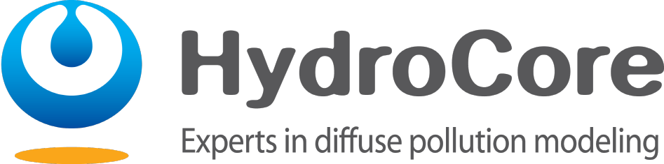
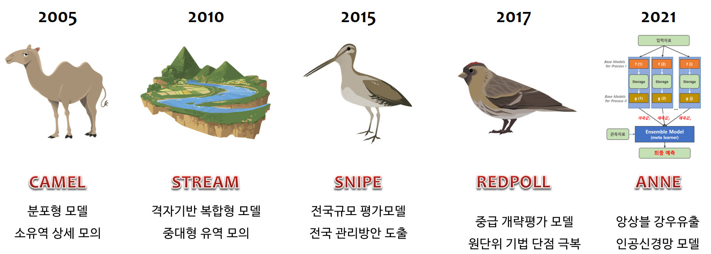

1234

### 유역모델 개발 및 적용

유역모델은 유역 내에서 발생하는 다양한 수문현상과 이와 연관된 오염물질 거동 양상을 수학적으로 표현한 컴퓨터 모의 도구입니다. 유역모델을 이용하여 우리는 유역에서 일어나는 수문현상과 오염부하의 시공간적 분포 특성을 이해할 수 있으며, 이를 통해 환경 변화에 따른 장래 변동성 예측과 관리 방안의 효과를 과학적으로 분석할 수 있습니다.

하이드로코어는 다양한 시공간 수준에 적용 가능한 유역모델을 독자적으로 개발하고 연구사업에 이를 적용하고 있습니다. 하이드로코어에서 개발한 유역모델의 이론적 배경과 적용사례를 살펴보면 다음과 같습니다.

### 개발 유역모델

- **CAMEL** (Chemicals, Agricultural Management and Erosion Losses)
- **STREAM** (Spatio-Temporal River-basin Eco-hydrology Analysis Model)
- **SNIPE** (Subsurface NItrogen Pollution Evaluation)
- **REDPOLL** (Regional Estimation of Diffuse POLlution Loads)
- **ANNE** (ANN for Environment)

### 연락처

- 주소	153-704 서울특별시 금천구 가산디지털1로 219 벽산디지털밸리6차 1104호
- TEL	02-2627-3570
- FAX	02-2627-3579
- EMAIL	
- WEB	www.hydrocore.co.kr
