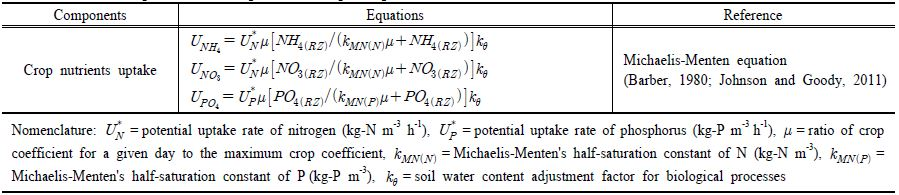

# 7. 농업 및 도시지역 모의

## 7.1 농업지역 모듈 ##

우리나라의 경우 밀도 높은 토지이용으로 인하여 하나의 유역 내에 농촌지역과 도시지역이 함께 위치하는 경우가 많다. 따라서 유역모델을 국내에 적용하기 위해서는 농촌지역과 도시지역을 함께 모의할 수 있어야 한다. 우리나라의 농촌유역은 논농사 중심으로 물의 저류와 관개가 빈번하게 수행되며, 이를 위해 하천에 배수문, 보 등의 인위적 수리 시설물이 산재하는 특징을 갖는다. 논에서는 강우 및 관개에 의해 논에 유입된 유량이 증발산과 침투를 통해 손실된 후, 남은 물의 높이가 물꼬높이보다 높으면 유출이 발생한다. 이는 영양물질 변환과 이동 등의 물질수지에도 영향을 미친다. 외국에서 개발된 대부분의 유역모델은 논에서의 수문과정을 고려하지 못하는 한계를 갖는다. 이를 개선하기 위해 논에서의 수문과정을 고려한 국내 연구로는 Kim et al. (2003), Jeon et al. (2007) 등의 연구가 있다. 이 중 Jeon et ad. (2007)은 HSPF에 기반하여 논에서의 담수능력과 시비에 의한 영양물질 농도변화를 모의하기 위한 HSPFPaddy 모델을 개발하였으며, Kim et al. (2014)은 보청천 유역에 대해 HSPF-Paddy의 적용성을 평가하였다. 논에 대한 STREAM에서의 유량 및 영양물질 수지를 모식도로 나타내면 Fig. 7과 같다.

 

Fig. 7. Water and nutrients mass balance in the paddy fields.

 
관개와 시비 등의 영농활동은 유역전체에서 동일시기에 수행되지 않으며, 지역적 특성에 따라 서로 다른 시기에 활동이 진행된다. 이를 고려하여 STREAM에서는 영농활동 시기를 토지피복별로 부여할 수 있도록 하였다. 따라서 동일한 논이라도 지역에 따라 서로 다른 토지피복으로 구분함으로써 서로 다른 시기의 영농활동을 부여할 수 있다. 한편, 논과 밭에 시비를 할 경우, 비료는 시용 즉시 작물이 흡수할 수 있는 성분으로 변환되지 않으며, 시간에 따라 점차적으로 용출되어 나온다. 이를 고려하여 STREAM에서는 비료 저장소를 설계하고 투입된 비료는 먼저 비료 저장소에 추가된 후 시간에 따라 저장소로부터 용출되는 것으로 가정하였다. 이때 용출속도는 지수적으로 감소하는 것으로 정의하였다. 이렇게 용출된 성분은 Table 5에 제시된 수질변환식에 의한 수질변환 과정에 참여하게 된다. 또한 담수된 논에서는 지표면으로부터 용존성, 입자성 물질이 수체로 공급된다. 용존성 물질의 경우 지표면과 수체가 저장소를 공유하여, 지표면 저장량을 담수량으로 나눠 담수의 수질농도를 산정한다. 입자성 물질의 경우에는 강우, 관개, 유출 등의 교란에 의해 부유하고 침강에 따라 농도가 안정화 되도록 모델을 설계하였다. 교란되어 부유하는 양은 교란의 원인인자인 강우, 관개, 유출 수량에 의한 로지스틱함수로 계산되며, 침강량은 논을 완전혼합반응조로 가정하고 단위 연산시간 동안 담수심 대비 입자의 침강길이 비율로 계산된다. 농촌지역에서는 농사에 필요한 물을 인접한 하천, 호수, 지하수 등에서 끌어다 쓰는 경우가 많다. 이 경우 자연적 물 흐름은 인위적으로 변경되어, 유역 내 수문과정에 큰 영향을 미치게 된다. 따라서 유역모델에서는 농촌지역의 관개 시스템을 반영할 필요가 있다. STREAM에서의 관개는 작물성장 시기에 따라 필요한 논의 권장담수심과 밭의 토양수분함량(soil water content) 최대값, 최소값을 설정하여 관개가 자동적으로 구현되도록 하였다. 논의 담수심과 밭의 토양수분함량이 시기별로 입력된 최소값보다 낮으면 관개를 시작하고, 논의 물높이와 밭의 토양수분함량이 최대값보다 높으면 관개를 멈추게 된다.

배수문(underflow gate)은 유입되는 물의 높이가 일정 수준 이상이 되었을 때 수문을 열어 하천 수심을 조절하는 시스템으로, STREAM에서는 수문의 형태로 우리나라에서 가장 흔하게 사용되는 수직 수문(vertical sluice)을 모델에 반영하였다. 수문을 개방할 경우 개방된 수문을 통한 유출량은 이론적으로 유속과 개방된 단면적을 곱하여 산정된다. 그러나 실제 유량은 접근수로의 수심 Hw 와 개방높이 P에 따라 차이를 보여주는데, 수리학에서는 이를 유량계수 Cd로 나타낸다(Henderson, 1966). 보(weir)는 높이가 일정하게 고정되어 있으며, 유입되는 물의 높이가 보의 높이보다 높을 경우 월류하여 하류로 이동하는 시스템이다. STREAM에서는 우리나라에서 가장 흔하게 사용되는 직사각형 보(rectangular weir)를 가정하며, 유량 산정은 유량계수 Cd와 접근속도계수 Cv 를 이용하여 산정한다(Sturn, 2010). STREAM에서 배수문과 보로부터 유량을 산정하는 방정식은 Table 8의 식과 같다.

Table 8. Selected equations for flow control structures in STREAM

## 7.2 도시지역 모듈 ##
도시 지역에서 발생하는 비점오염물질의 발생과 이동을 모의하기 위해 불투수지표면에서 발생하는 입자성 오염물질의 축적(build-up) 과정을 모델에 반영하였다. 도시 지역에서 입자성 오염물질의 축적 과정은 무강우 일수에 대한 비선형적 시간함수로 표현되는데, 일반적으로 saturation function, power function, exponential function이 사용된다(Rossman, 2010). STREAM에서는 위의 3가지 축적함수를 모두 지원하여 사용자가 유역 환경에 맞는 함수식을 지정하도록 하였다(Table 9). 불투수지표면에서 발생하는 입자성 오염물질은 탄소, 질소, 인 등의 화학성분을 포함한다. 이를 산정하기 위해 STREAM에서는 입자성 오염물질의 축적량을 계산한 후, 입자성 오염물질에 포함된 탄소, 질소, 인의 비율(mg/kg)을 이용하여 각 성분의 축적량을 계산한다. 각 성분의 구성 비율은 사용자로부터 입력 받는다. 무강우 시에는 제시된 축적함수에 따라 도시 노면에 오염물질이 축적되며, 강우 시에는 강우로 인해 형성된 지표면 유출에 의해 축적된 오염물질이 하천이나 관망으로 유입된다. STREAM에서 도시지역에 축적된 입자성 오염물질의 유출을 유사 이동과 동일하게 입도 크기에 따라 4개 클래스로 구분하여, Van Rijn (1984)의 방법을 적용하여 모의한다.

Table 9. Selected equations for particulate matter buildup processes in urban areas in STREAM
