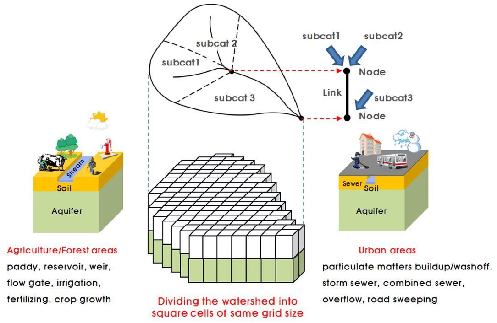

# 2. 주요 특징

## 2.1 주요 기능 ##

유역모델 STREAM은 다음의 주요 기능 및 특징을 가지며, 모델의 각 구성 요소는 필요에 따라 용이하게 변경 또는 확장할 수 있도록 모듈 형식으로 개발되었다.

- 대상 유역을 임의 크기의 정방형 격자로 분할하고, 격자에서의 물질수지를 계산한다.
- 모의 시간간격은 하천길이와 유속을 고려하여 모델 내부에서 결정하거나 또는 사용자가 지정한 시간 간격을 사용한다.
- 지표수의 유동은 정상류(steady flow)로 가정하여 Manning 공식에 의해 해석하며, 연산속도 향상을 위해 격자간 물질이동은 생략한다.
- 호수 및 저수지는 제방이나 댐의 제원에 따라 모델 내부에서 생성한다.
- 논밭의 둑과 하천제방의 높이에 따라 지표수의 흐름을 제어할 수 있다.
- 도시지역의 경우 분류식, 합류식 관거시스템을 구별하여 모의하며, 대상 유역에서 차집 또는 펌핑을 통한 물의 이동이 발생할 경우 이를 모의할 수 있다
- 지표수 유동에 의한 토양에서의 유사의 이동을 입도에 따라 clay, silt, fine sand 및 coarse sand 등으로 구분하여 모의한다.
- 도시지역 불투수지표면에서의 입자성 오염물질의 축적과 유출 과정을 모의한다.
- 토양/지표수/지하수 중의 탄소, 질소, 인 변환과정과 이동을 모의한다.

## 2.2 공간분할 구조 ##

STREAM의 유역 공간분할 구조를 Fig. 1과 같이 정의하였다. 모의 대상 유역은 다수의 소유역으로 구분되며 소유역 사이의 상하류 위계관계는 노드-링크의 연결 구조로 표현된다. 소유역은 다시 일정 크기의 정방형 격자로 분할되며, 각 격자는 다시 지표면, 토양층, 대수층의 수직적 구조를 갖는다.

분포형 모델은 개별격자 하나하나에 대해 연산을 수행하기 때문에 계산 속도가 크게 저하되는 단점이 있다. STREAM에서는 이를 개선하기 위해 유역에 포함된 개별 격자를 공간적 속성에 따라 유사한 여러 개의 그룹으로 구분하고 그룹별로 1회의 연산만을 수행한 후 이를 그룹에 속한 개별 격자에 부여하는 방법을 사용한다. 이때, 연산이 수행되는 최소 단위인 격자의 그룹을 수문학적 단위격자 HUCs (Hydrological Unit Cells)라 한다. HUCs는 사용자가 지정한 토지이용, 토양, 경사도, 강우, 기상, 관망 특성 등에 따라 모델 내부에서 정의된다.

Fig. 1. Representation of a watershed using square grid cells and link-node structures in STREAM

