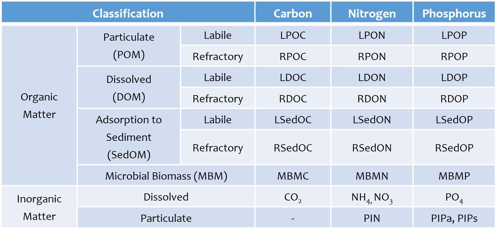
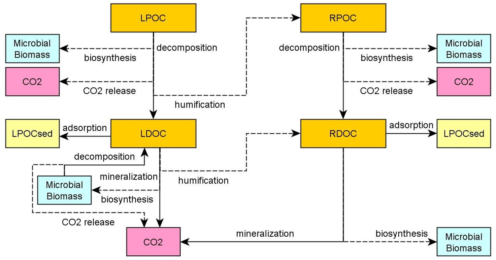
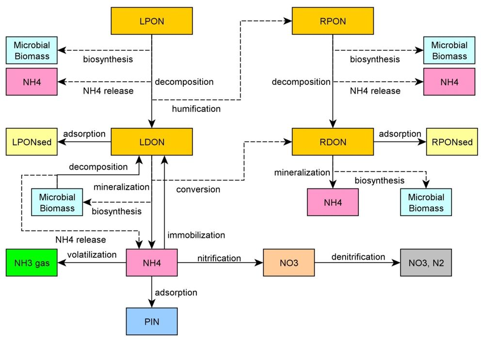
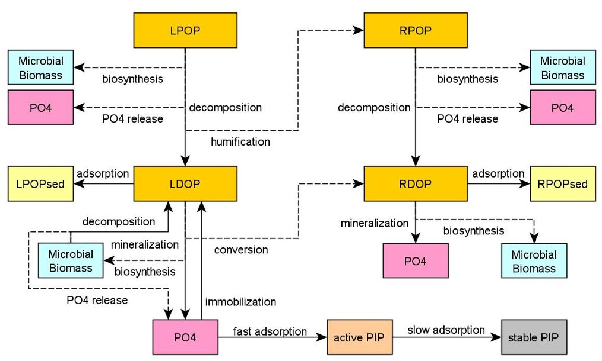
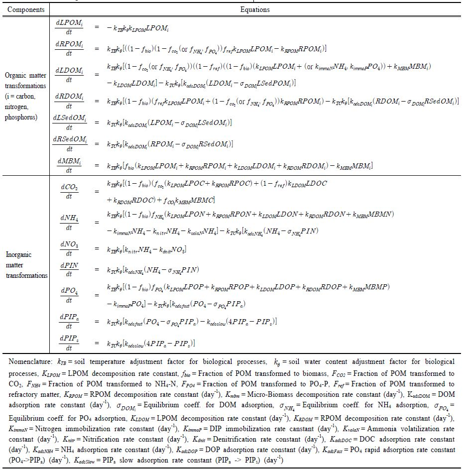
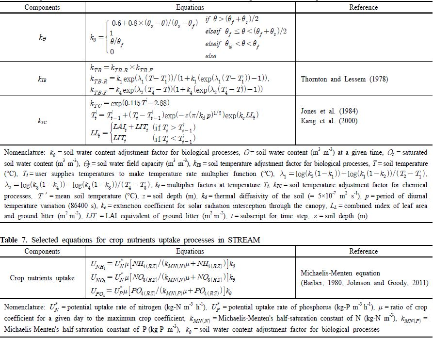
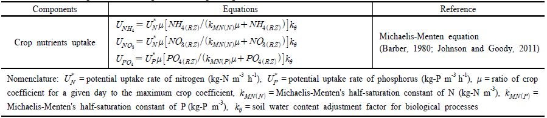

# 6. 영양물질

## 6.1 영양물질 구분 ##

영양물질은 유기체가 생존하고 성장하는데 필요로 하는 화학물질이자, 유기체의 신진대사를 위해 주위 환경에서 섭취해야 하는 물질이다. 영양물질 중 STREAM에서 사용되는 화학성분은 탄소(carbon), 질소(nitrogen), 인(phosphorus)이다(Table 4). 영양물질은 크게 유기물(organic matter)과 무기물(inorganic matter)로 구분한다. 유기물은 입자의 크기와 존재 형태에 따라 입자 형태로 존재하는 POM (Particulate Organic Matter)과 용존 형태로 존재하는 DOM (Dissolved Organic Matter) 그리고 부유사 또는 토양 입자에 흡착된 형태로 존재하는 SedOC (Organic Carbon adsorbed to Sediments)로 구분된다. 그리고 이러한 3가지의 유기물의 형태는 미생물에 의해 분해되는 속도에 따라 분해속도가 빠른 생분해성(Labile)과 분해속도가 느린 난분해성(Refractory)으로 구분된다. LPOM은 토양에서 존재하는 형태에 따라 식물의 잎, 뿌리 등의 잔재물(litter)과 퇴비(manure)로 구분되며, 분해속도가 매우 빠르다. Humus의 형태로 존재하는 RPOM은 매우 안정화되어 있는 유기물로서 분해속도가 매우 느리다. 그리고 유기물을 분해시키는 역할을 하는 미생물은 MBM (microbial biomass)으로, 미생물의 분해과정에서 발생하는 무기물은 CO2, NH4, PO4로 정의하였다.NH4가 질산화되면 NO3가 생성되고, 토양 입자에 흡착되면 PIN (Particulate Inorganic Nitrogen)으로 변환된다. PO4가 토양 입자에 흡착되면 활성화된 PIPa (Active Particulate Inorganic Phosphorus)와 안정화된 PIPs (Stable Particulate Inorganic Phosphorus)로 변환되다.

Table 4. Nutrient variables for soil and water in STREAM

## 6.2 영양물질의 유입과 이동 ##

유역 내 영양물질 저장소는 공간적 위치에 따라 지표면, 토양층, 대수층, 하천으로 구분한다(Fig. 3). 유역 내 유기물의 이동은 지표면에서 발생한 지표유출수, 토양내부에서 발
생하는 중간류, 대수층에서 발생하는 지하유출수를 통해 토양에서 하천으로 이동한다. 토양으로 유입되는 유기물은 식물, 동물, 인간 활동에 기인한다. 식물에서 발생하는 유기물은 낙엽(litter), 식생잔재물(residue)의 형태로, 동물에서 발생하는 유기물은 동물의 배설물(excretion)의 형태로, 인간의 농업활동에서 발생하는 유기물은 퇴비(manure)와 비료(fertilizer)의 형태로, 도시의 불투수지표면에서 발생하는 유기물은 입자상 오염물질(particulate pollutants)의 형태로 토양으로 유입된다. 유입된 유기물은 지표면 또는 토양내부로 이동하며, 물과 유사의 흐름과 함께 하천으로 이동한다.수체로 유입되는 유기물의 형태는 발생기원에 따라 크게 내부생성과 외부생성으로 구분한다. 내부생성 유기물은 수체 내 조류(식물성 플랑크톤, 동물성 플랑크톤, 부착조류)에 의해 발생하며, 외부생성 유기물은 토양에서 유입되는 지표유출수, 중간류, 지하수유출수와 도시의 관망에서 유입되는 관거유출수, 하수처리장 배출수를 통해 유입된다.

Fig. 3. A schematic diagram showing input and transport processes of nutrients in STREAM.

## 6.3 영양물질의 변환 ##

토양과 수체에서의 탄소, 질소, 인의 변환 과정은 Fig. 4~6과 같다. Fig. 4는 STREAM에서의 탄소 순환과정을 도식화한 것이다. 유기물의 분해는 미생물(MBM)이 유기물을 기질로 사용하여 생합성(biosynthesis)을 하고 에너지를 취하는 과정이며, 이 때 부산물로서 무기물이 생성된다. 유기물의 분해과정에서 미생물의 생합성에 이용되는 유기물의 비율은 생합성 비율(fbio)이며, 유기물이 분해될 때 생합성에 이용되지 않고 남은 유기물의 일부는 난분해성 물질로 변환되는데 그 비율은 fref 로 정의된다. 미생물에 의해 생합성이 되지 않거나 난분해성 물질로 변환되지 않은 유기물의 일부는 fCO2, fNH4, fPO4의 비율로 CO2, NH4, PO4로 변환되며 나머지는 미생물에 의해 에너지원으로 이용된다. 토양과 수체 내 탄소, 질소, 인 유기물의 변환과정은 기본적으로 동일한 형태를 나타내는 것으로 가정하였으며, 질소 변환은 C/N 비율에 따라 탄소 변환의 일부분으로서 발생하는 것으로 설계하였다. 입자상 유기물의 형태로 존재하는 LPOM와 RPOM는 미생물의 분해 작용으로 인해 각각의 분해속도에 따라 LDOM와 RDOM로 변환되며, 이 중 일부는 미생물의 섭취로 인해 미생물 생체량 증식에 이용되며, 일부는 호흡작용으로 인해 CO2의 형태로 변환되어 대기 중으로 이동한다. 입자상 유기물 중 LPOM은 부식화 과정을 통해 난분해성 물질인 RPOM로 변환한다.

Fig. 4. A schematic diagram showing soil carbon storages and transformation processes in STREAM.

Fig. 5는 STREAM에서의 질소 순환과정을 도식화한 것이다. 식생에 의한 흡수와 암모니아 휘발, 질산화, 탈질화 등의 과정은 1차 방정식으로 표현되며,이 밖에 비료 시비, 대기 낙하, 토양미생물에 의한 질소 고정 등은 사용자에 의해 상수로 부여된다. 

Fig. 5. A schematic diagram showing soil nitrogen storages and transformation processes in STREAM. 

Fig. 6은 STREAM에서의 인 순환과정을 도식화한 것이다. STREAM에서 인의 변환과정은 7개의 유기인 저장소(LPOP, RPOP, LDOP,RDOP, LSedOP, RSedOP, MBMP)와 3개의 무기인 저장소(PO4, PIPa 및 PIPs)를 이용하여 모의된다. 유기인은 식물잔재물, 가축의 분뇨, 퇴비 및 미생물군으로부터 입력된다. 활성 무기인 저장소(PIPa)는 퇴적물 입자의 표면에 물리적으로 흡착된 상태의 무기인이며, 비활성 무기인 저장소(PIPs)는 퇴적물 입자의 표면에 화학적으로 결합한 형태의 무기인을 의미한다. 한편, 식물이 즉시 이용 가능한 형태의 무기인은 PO4로 정의된다. PIPa와 PO4는 평형에 빠르게 도달하며 PIPa와 PIPs는 평형에 도달하는 시간이 오래 걸리는 특징을 갖는다.

Fig. 6. A schematic diagram showing soil phosphorus storages and transformation processes in STREAM.

STREAM에서 탄소, 질소, 인의 변환과정은 first-order kinetic equations을 이용하여 정의되며, 개별 방정식은 4th-order Runge-Kutta 방법으로 해석된다. STREAM에서 사용되는 이상의 토양과 수체 내 영양물질 변환 방정식을 정리하면 Table 5와 같다.

Table 5. Selected equations for nutrients transformations in STREAM

STREAM은 토양 중 탄소, 질소, 인의 변환과정에 영향을 미치는 주요 요인으로 토양 수분과 토양 온도를 명시적으로 고려한다(Table 6). 토양수분조정계수(kθ)는 현재의 토양수분(θ)과 토성별로 부여된 wilting point (θw), field capacity(θf), saturated water content (θs)를 비교하여 산정된다. 토양온도는 미생물의 활동과 화학 반응에 영향을 미치는 요인으로 작용한다. 생물학적 반응에 대한 토양온도조정계수(kTB)는 Thornton and Lessem (1978)이 제안한 식에 따르며, 화학반응에 대한 토양온도조정계수(kTC)는 Jones et al.(1984)에 제안한 식을 따른다. kTB, kTC 에 포함된 토양온도는 식생의 엽면적지수와 토양 표층의 낙엽을 고려하여 산정된다(Kang et al., 2000). 수체의 경우 수분이 포화된 상태로 수분에 따른 조정계수 값으로 1을 사용하며, 온도조정계수는 수체온도를 이용하여 토양과 동일하게 Jones et al. (1984)에 제안한 식을 이용하여 산정한다. 수체온도는 대기온도를 이용하여 Stefan and Preud'homme (1993)이 제시한 식(Twater = 5.0 + 0.75 × Tair)에 의해 산정한다.

Table 6. Adjustment factors for soil water and soil temperature for biological and chemical processes in STREAM

## 6.4 식생에 의한 흡수 ##
STREAM에서 식물 뿌리에 의한 무기물의 흡수는 Michaelis-Menten Kinetics (Barber, 1980)를 따른다(Table 7). 식물 뿌리에 의해 흡수될 수 있는 무기물은 토양 내 무기물 중 근권(rhizosphere)의 영역 안에 있는 무기물로, 토양 내 무기질은 토양 아래로 내려갈수록 지수적으로 감소하는 것으로 가정하였다. 식물 뿌리에 의한 무기물의 흡수량 산정에 사용되는 매개변수 중 UN* , UP* , kMN(N), KMN(P)와 함께 일별식물성장비율(μ)를 함께 적용함으로써 계절에 따른 식물생장 및 무기물 요구량의 변동을 고려하였다. 또한 토양수분조정계수(kθ)를 적용함으로써 토양 함수량에 의해서도 무기물의 식물 흡수량이 제한된다. 토양함수량이 field capacity 이상이면 무기물의 흡수에 제한이 없으며 field capacity 이하이면 선형으로 감소하여 wilting point에 이르면 무기물의 흡수는 멈추게 된다.

Table 7. Selected equations for crop nutrients uptake processes in STREAM

