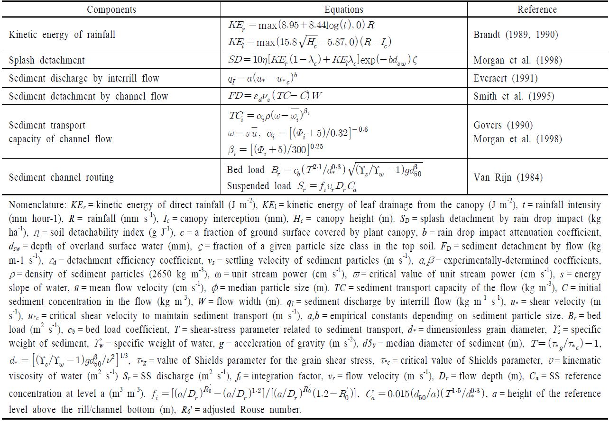

# 5. 토양침식과 유사이동

부유사 이동 모의기법에 따라 유역모델을 분류하면, 미국 SCS에서 개발한 USLE (Universal Soil Loss Equation) 경험식을 사용하는 모델과 토양 침식과 부유사 이동을 물리식에 기초하여 모의하는 모델로 구분할 수 있다. USLE는 개념이 간단하고 사용이 용이하여 세계적으로 많은 모델에서 사용되고 있다. 그러나 Jetten and Favis-Mortlock (2006)은 USLE가 미국 동부지역을 중심으로 개발된 경험식으로 강우,주요 수문과정, 경관 다양성(landscape diversity) 등의 차이로 인하여 유럽지역 적용에 한계가 따른다고 설명하였다. 국내 환경을 고려할 때 이러한 차이는 동일할 것으로 판단되며, 따라서 국내 적용 시 USLE 내에 포함된 매개변수 값 설정에 주의가 요구된다. 이러한 이유로 최근 WEPP, EUROSEM 등 물리식에 기초하여 부유사 이동을 모의하기 위한 모델 이 제시되어 그 이용이 확대되어가고 있는 실정이다. 물리식에 기초한 국내 연구진의 토양침퇴적 모델 개발 연구로는 GRISMORM (Kim and Chae, 2000), CAMEL (Koo et al., 2005), DANSAT (Cho and Mostaghimi, 2009) 등이 있다. 본 연구에서 제시한 STREAM은 부유사 이동 과정을 물리식에 기초하여 모의하도록 설계되었다.

토양 침식과 유사(sediment) 이동 과정은 육상과 하천에서 모두 발생한다. 유사 이동 과정을 STREAM에서는 수문 현상과 동일하게 격자, 소유역, 하천으로 구분하여 모의한다. 격자에서는 육상(interrill)과 릴(rill)에서의 토양 침식과 이동을 모의하며, 소유역에서는 소유역에 포함된 전체 격자에서 발생한 토양 침식과 이동량 중 소유역 말단의 출구를 통해 하류 하천으로 이동하는 유사량을 모의한다. 하천에서의 유사 이동은 전체 유역을 구성하는 각 소유역에서 공급된 유사가 하천 또는 관망에서 퇴적, 침식, 이동되는 과정을 모의한다(Table 3). 격자의 육상과 릴, 소유역, 하천에는 유사 저장소를 갖고 있으며, 이들 각 저장소는 유사 입도에 따라 점토, 미사, 세립사 및 조립사 등 4개의 저장소로 구분된다. 각 저장소별 유효입경 기본값은 USDA (1987)의 입경구분(coarse sand:  500~2,000 μm, medium sand: 250~500 μm, find sand: 50~500 μm, silt: 2~50 μm, clay: < 2 μm)을 참고하여 대표입경으로 점토 1 μm, 미사 10 μm, 세립사 100 μm 및 조립사 1000 μm으로 지정하였으며, 사용자 입력을 통해 이 값을 변경할 수 있도록 하였다.강우 시 토양 표면에 있는 유사 입자들은 빗방울의 충격에 의해 분리되는데, 이러한 현상은 강우 운동에너지와 관련이 있다. STREAM은 직접적인 빗방울과 수관을 거쳐 떨어지는 물방울에 의한 효과를 구분하여 산정한다(Brandt, 1989, 1990). 총 운동에너지는 식생, 지표수 등 지표의 상태를 감안하여 산정되는데, 빗방울에 의한 유사 분리는 입도별로 계산된다(Morgan et al., 1998). 빗방울에 의해 분리된 유사는 육상의 유사 저장소에 더해진다. 빗방울에 의해 분리된 유사 입자들은 육상지역에서의 지표유출수에 의해 릴까지 이동된다. 릴 사이의 육상지역에서의 유사 이동량은 전단속도(shear velocity)에 기초한 Everaert (1991) 방정식을 따르며, 유사 이동이 시작되는 임계전단속도(critical shear velocity)는 입경에 따라 산정된다. 물의 흐름에 의한 릴 및 하천에서의 유사 분리는 Smith et al. (1995)이 제안한 침식-퇴적 이론을 바탕으로 모의된다. Smith et al. (1995)가 제시한 침식-퇴적 이론은 유효입경에 따른 유사 입자의 침강속도와 흐르는 물의 유사 운반능력(sediment transport capacity)을 이용하여 표현된다. 유사 입자의 침강속도(vs)는 물의 밀도와 점도가 일정하다는 가정하에 Stokes 법칙을 이용하여 계산한다. 유사 운반능력을 계산하기 위해서는 초기 유사농도가 요구되는데, STREAM에서는 릴 사이 지역에서 배출되는 유사량을 지표유출수량으로 나누어 산정한다. 이때, 주어진 지점에서 지표수의 유사 운반능력은 순수한 최대 침식량으로 계산된다(Govers, 1990; Morgan et al., 1998). 릴과 하천의 유사 운반능력이 초기 유사농도보다 크면 유사 입자가 추가로 분리되어(flow detachment) 하류로 운반되며, 그렇지 않은 경우에는 초기 유사농도와 유사 운반능력 차이만큼의 유사가 퇴적되어 저장소에 더해진다. Govers (1990)는 유사 운반이 시작되는 단위 수류력(unit stream power)의 임계치를 0.4 cm s-1로 제안하였는데, 그의 연구는 coarse silt부터 coarse sand까지의 제한된 입도 범위 내에서 이루어진 것이어서 clay나 fine silt 입자에는 적합하지 않을 수 있다. 따라서 STREAM에서는 단위 수류력 임계치(ϖ)를 입도에 따라 사용자가 정할 수 있도록 하였다. Smith et al. (1995)이 제시한 방정식에 포함된 유사 분리 계수(εd)는 젖은 토양의 점착성과 식생 뿌리의 고정 작용에 의해 유사 분리가 감소하는 영향을 표현하기 위한 것이다. 유사 분리 계수는 점착성 증가에 따라 εd = 0.79exp(-0.85(ϛ+η))와 같이 지수적으로 감소된다(Morgan et al., 1998). 여기서 ϛ 는 젖은 토양의 점착력(kPa), η는 식생 뿌리에 의해 증가하는 토양 점착력(kPa)을 나타낸다. STREAM에서는 ϛ 를 상대적으로 느슨한 토양과 굳은 토양으로 구분하여 사용자로부터 입력받는다. 유사 분리 계수(εd)는 유사 운반능력이 초기 유사농도보다 작은 경우, 즉 순 퇴적이 일어나는 경우, 1의 값을 갖는다. 릴과 하천에서의 유사 이동은 이동 형태에 따라 물에 떠서 이동하는 부유사(suspended load)와 바닥에 끌리거나 튀면서 이동하는 소류사(bed load)로 구분된다. STREAM에서는 Van Rijn (1984)이 제시한 방법을 적용하여 부유사 및 소류사의 이동을 각각 계산한다. 하천과 관망에서의 유사 이동 과정은 릴에서의 유사 이동과 같은 방식으로 계산된다. STREAM은 유사 이동 과정을 4개의 입도별로 계산하기 때문에 임의의 시간과 지점에서 하천의 유사 운반능력에 따라 하상 퇴적물의 입도 구성이 변동하는 것을 모의할 수 있다.

Table 3. Selected equations for sediment transport processes in STREAM
